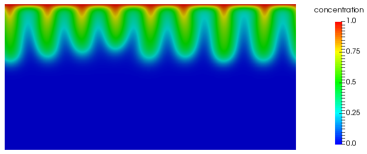
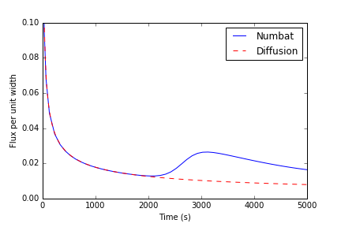
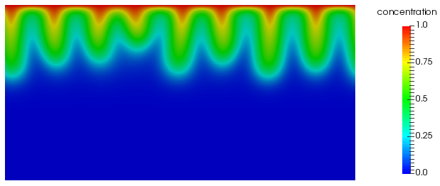
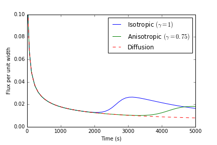

<div class="page-wrap">

-   [Installation](../getting_started/index.html)

<!-- -->

-   [Governing equations](../governing_equations/index.html)

<!-- -->

-   [Available objects](../systems/index.html)

<!-- -->

-   [Input file syntax](../input_file_syntax/index.html)
-   [2D](index.html)
-   [3D](../example3D/index.html)

<!-- -->

-   [User manual](../download/index.html)

<div class="nav-wrapper container">

[Numbat](../index.html){.page-title}
-   [Getting Started*arrow\_drop\_down*](#!){.dropdown-button}
-   [Theory*arrow\_drop\_down*](#!){.dropdown-button}
-   [Systems*arrow\_drop\_down*](#!){.dropdown-button}
-   [Examples*arrow\_drop\_down*](#!){.dropdown-button}
-   [Manual*arrow\_drop\_down*](#!){.dropdown-button}
-   <div class="input-field search-wrapper">

    *search* *close*
    <div class="search-results">

    </div>

    </div>

-   [{.github-mark}GitHub](https://github.com/cpgr/numbat){.github-mark-label}

</div>

<div class="container">

<div class="row">

<div class="col s12 m12 l12">

<div class="nav-wrapper">

<div class="col s12 m9 l10">

<span class="breadcrumb"></span> [example2D](index.html){.breadcrumb}

</div>

</div>

</div>

</div>

<div class="row">

<div id="moose-markdown-content" class="col s12 m8 l9">

2D examples {#2d-examples}
===========

Complete input files for 2D modules using the dimensional and
dimensionless streamfunction formulations are provided, for both
isotropic and anisotropic porous media. These examples are provided in
the Numbat *examples* folder.

<div id="isotropic-models" class="section scrollspy">

Isotropic models
----------------

The first 2D examples are for an isotropic porous medium (
).
### Input file

The complete input file for this problem is

<div class="moose-float-div moose-listing-div" style="label:False;">

``` {style="overflow-y:scroll;max-height:350px"}
copy# 2D density-driven convective mixing. Instability is seeded by small perturbation
# to porosity. Takes about 5 minutes to run using a single processor.

[Mesh]
  type = GeneratedMesh
  dim = 2
  ymax = 1.5
  nx = 100
  ny = 50
[]

[MeshModifiers]
  [./bias]
    type = NumbatBiasedMesh
    refined_edge = top
    refined_resolution = 0.001
    num_elems = 50
  [../]
[]

[Variables]
  [./concentration]
    initial_condition = 0
    scaling = 1e6
  [../]
  [./pressure]
    initial_condition = 1e6
  [../]
[]

[AuxVariables]
  [./noise]
    family = MONOMIAL
    order = CONSTANT
  [../]
[]

[ICs]
  [./noise]
    type = RandomIC
    variable = noise
    max = 0.003
    min = -0.003
  [../]
[]

[Materials]
  [./porosity]
    type = NumbatPorosity
    porosity = 0.3
    noise = noise
  [../]
  [./permeability]
    type = NumbatPermeability
    permeability = '1e-11 0 0 0 1e-11 0 0 0 1e-11'
  [../]
  [./diffusivity]
    type = NumbatDiffusivity
    diffusivity = 2e-9
  [../]
  [./density]
    type = NumbatDensity
    concentration = concentration
    zero_density = 995
    delta_density = 10.5
    saturated_concentration = 0.049306
  [../]
  [./viscosity]
    type = NumbatViscosity
    viscosity = 6e-4
  [../]
[]

[Kernels]
  [./time]
    type = NumbatTimeDerivative
    variable = concentration
  [../]
  [./diffusion]
    type = NumbatDiffusion
    variable = concentration
  [../]
  [./convection]
    type = NumbatConvection
    variable = concentration
    pressure = pressure
  [../]
  [./darcy]
    type = NumbatDarcy
    variable = pressure
    concentration = concentration
  [../]
[]

[BCs]
  [./conctop]
    type = PresetBC
    variable = concentration
    boundary = top
    value = 0.049306
  [../]
  [./Periodic]
    [./x]
      variable = concentration
      auto_direction = x
    [../]
  [../]
[]

[Preconditioning]
  [./smp]
    type = SMP
    full = true
  [../]
[]

[Executioner]
  type = Transient
  l_max_its = 200
  end_time = 3e5
  solve_type = NEWTON
  petsc_options = -ksp_snes_ew
  petsc_options_iname = '-pc_type -sub_pc_type -ksp_atol'
  petsc_options_value = 'bjacobi ilu 1e-12'
  nl_abs_tol = 1e-10
  nl_max_its = 25
  dtmax = 2e3
  [./TimeStepper]
    type = IterationAdaptiveDT
    dt = 1
  [../]
[]

[Postprocessors]
  [./boundaryfluxint]
    type = NumbatSideFlux
    variable = concentration
    boundary = top
  [../]
  [./mass]
    type = NumbatTotalMass
    variable = concentration
  [../]
[]

[Outputs]
  [./console]
    type = Console
    perf_log = true
    output_nonlinear = true
  [../]
  [./exodus]
    type = Exodus
    file_base = 2Dddc
    execute_on = 'INITIAL TIMESTEP_END'
  [../]
  [./csvoutput]
    type = CSV
    file_base = 2Dddc
    execute_on = 'INITIAL TIMESTEP_END'
  [../]
[]
```

<div>

[(2Dddc.i)](https://github.com/cpgr/numbat/blob/master/examples/2D/isotropic/2Dddc.i){.moose-listing-link
.tooltipped}

</div>

</div>

### Running the example

This example can be run on the commandline using

        numbat-opt -i 2Dddc.i

Alternatively, this file can be run using the *Peacock* gui provided by
MOOSE using

        peacock -i 2Dddc.i

in the directory where the input file *2Dddc.i* resides.

### Results

This 2D example should take only a few minutes to run to completion,
producing a concentration profile similar to that presented in [Figure
1](#Figure){.moose-float-reference}, where several downwelling plumes of
high concentration can be observed after 3528 s:

<div id="fig:2D" class="moose-float-div moose-figure-div"
data-moose-float-name="Figure" style="width:80%;margin-left:10px;">

{.materialboxed width="100%"}
<span class="moose-float-caption-heading"><span
class="moose-float-caption-heading-label">Figure </span><span
class="moose-float-caption-heading-number">1</span><span
class="moose-float-caption-heading-suffix">: </span></span><span
class="moose-float-caption-text">2D concentration profile (t = 3528
s)</span>

</div>

The flux per unit width over the top boundary is of particular interest
in many cases (especially convective mixing of
). This is calculated using the *boundaryfluxint* postprocessor in the
input file, and presented in [Figure
2](#Figure){.moose-float-reference}.

<div id="fig:2Dflux" class="moose-float-div moose-figure-div"
data-moose-float-name="Figure" style="width:80%;margin-left:10px;">

{.materialboxed width="100%"}
<span class="moose-float-caption-heading"><span
class="moose-float-caption-heading-label">Figure </span><span
class="moose-float-caption-heading-number">2</span><span
class="moose-float-caption-heading-suffix">: </span></span><span
class="moose-float-caption-text">2D flux across the top boundary</span>

</div>

Initially, the flux is purely diffusive, and scales as
, where
is time (shown as the dashed red line). After some time, the convective
instability becomes sufficiently strong, at which point the flux across
the top boundary rapidly increases (at a time of approximately 2000
seconds).

</div>

<div id="anisotropic-models" class="section scrollspy">

Anisotropic models
------------------

The second 2D example is for an anisotropic porous medium with
(ie., the vertical permeability is three quarters of the horizontal
permeability).
### Input file {#input-file_1}

<div class="moose-float-div moose-listing-div" style="label:False;">

``` {style="overflow-y:scroll;max-height:350px"}
copy# 2D density-driven convective mixing. Instability is seeded by small perturbation
# to porosity. Permeability anisotropy is introduced with ky/kx = 0.5.
# Takes about 5 minutes to run using a single processor.

[Mesh]
  type = GeneratedMesh
  dim = 2
  ymax = 1.5
  nx = 100
  ny = 50
[]

[MeshModifiers]
  [./bias]
    type = NumbatBiasedMesh
    refined_edge = top
    refined_resolution = 0.001
    num_elems = 50
  [../]
[]

[Variables]
  [./concentration]
    initial_condition = 0
    scaling = 1e6
  [../]
  [./pressure]
    initial_condition = 1e6
  [../]
[]

[AuxVariables]
  [./noise]
    family = MONOMIAL
    order = CONSTANT
  [../]
[]

[ICs]
  [./noise]
    type = RandomIC
    variable = noise
    max = 0.003
    min = -0.003
  [../]
[]

[Materials]
  [./porosity]
    type = NumbatPorosity
    porosity = 0.3
    noise = noise
  [../]
  [./permeability]
    type = NumbatPermeability
    permeability = '1e-11 0 0 0 5e-12 0 0 0 1e-11'
  [../]
  [./diffusivity]
    type = NumbatDiffusivity
    diffusivity = 2e-9
  [../]
  [./density]
    type = NumbatDensity
    concentration = concentration
    zero_density = 995
    delta_density = 10.5
  [../]
  [./viscosity]
    type = NumbatViscosity
    viscosity = 6e-4
  [../]
[]

[Kernels]
  [./time]
    type = NumbatTimeDerivative
    variable = concentration
  [../]
  [./diffusion]
    type = NumbatDiffusion
    variable = concentration
  [../]
  [./convection]
    type = NumbatConvection
    variable = concentration
    pressure = pressure
  [../]
  [./darcy]
    type = NumbatDarcy
    variable = pressure
    concentration = concentration
  [../]
[]

[BCs]
  [./conctop]
    type = NumbatPerturbationBC
    variable = concentration
    boundary = top
    value = 1.0
  [../]
  [./Periodic]
    [./x]
      variable = concentration
      auto_direction = x
    [../]
  [../]
[]

[Preconditioning]
  [./smp]
    type = SMP
    full = true
  [../]
[]

[Executioner]
  type = Transient
  l_max_its = 200
  end_time = 5e5
  solve_type = NEWTON
  petsc_options = -ksp_snes_ew
  petsc_options_iname = '-ksp_atol'
  petsc_options_value = '1e-10'
  nl_abs_tol = 1e-9
  dtmax = 1e3
  [./TimeStepper]
    type = IterationAdaptiveDT
    dt = 1
  [../]
[]

[Postprocessors]
  [./boundaryfluxint]
    type = NumbatSideFlux
    variable = concentration
    boundary = top
  [../]
  [./mass]
    type = NumbatTotalMass
    variable = concentration
  [../]
[]

[Outputs]
  [./console]
    type = Console
    perf_log = true
    output_nonlinear = true
  [../]
  [./exodus]
    type = Exodus
    file_base = 2Dddc
    execute_on = 'INITIAL TIMESTEP_END'
  [../]
  [./csvoutput]
    type = CSV
    file_base = 2Dddc
    execute_on = 'INITIAL TIMESTEP_END'
  [../]
[]
```

<div>

[(2Dddc.i)](https://github.com/cpgr/numbat/blob/master/examples/2D/anisotropic/2Dddc.i){.moose-listing-link
.tooltipped}

</div>

</div>

Note that the permeability anisotropy is introduced in the kernels using
the *gamma* and *anisotropic\_tensor* input parameters.

### Running the example {#running-the-example_1}

This example can be run on the commandline using

        numbat-opt -i 2Dddc_anisotropic.i

Alternatively, this file can be run using the *Peacock* gui provided by
MOOSE using

        peacock -i 2Dddc_anisotropic.i

in the directory where the input file *2Dddc\_anisotropic.i* resides.

### Results {#results_1}

This 2D example should take only a few minutes to run to completion,
producing a concentration profile similar to that presented in [Figure
3](#Figure){.moose-float-reference}, where several downwelling plumes of
high concentration can be observed after 5000 s:

<div id="fig:2Da" class="moose-float-div moose-figure-div"
data-moose-float-name="Figure" style="width:80%;margin-left:10px;">

{.materialboxed width="100%"}
<span class="moose-float-caption-heading"><span
class="moose-float-caption-heading-label">Figure </span><span
class="moose-float-caption-heading-number">3</span><span
class="moose-float-caption-heading-suffix">: </span></span><span
class="moose-float-caption-text">2D concentration profile for </span>
(t = 5000 s)

</div>

In comparison to the isotropic example (with
) presented in [Figure 1](#Figure){.moose-float-reference}, we note that
the concentration profile in the anisotropic example has only reached a
similar depth after 5000 s (compared to 3528 s). The effect of the
reduced vertical permeability in the anisotropic example slows the
convective transport.
This observation can be quantified by comparing the flux per unit width
over the top boundary of both examples, see [Figure
4](#Figure){.moose-float-reference}.

<div id="fig:2Dfluxcomp" class="moose-float-div moose-figure-div"
data-moose-float-name="Figure" style="width:80%;margin-left:10px;">

{.materialboxed width="100%"}
<span class="moose-float-caption-heading"><span
class="moose-float-caption-heading-label">Figure </span><span
class="moose-float-caption-heading-number">4</span><span
class="moose-float-caption-heading-suffix">: </span></span><span
class="moose-float-caption-text">Comparison of the 2D flux across the
top boundary</span>

</div>

The inclusion of permeability anisotropy delays the onset of convection
in comparison to the isotropic example, from a time of approximately
2000 seconds in the isotropic example to approximately 3500 seconds in
the anisotropic example.

</div>

</div>

<div class="col hid-on-small-only m4 l3">

<div class="toc-wrapper pin-top">

<div class="moose-devel-links-container">

</div>

<div class="section table-of-contents">

-   [Isotropic models](#isotropic-models)
-   [Anisotropic models](#anisotropic-models)

</div>

</div>

</div>

</div>

</div>

</div>

<div class="container white-text">

<div class="row">

<div class="col s12">

Site Generated with [MOOSE](https://www.mooseframework.org)

[Edit
Markdown](https://github.com/cpgr/numbat/edit/devel/docs/content/example2D.md){.moose-edit-markdown}

</div>

</div>

</div>
